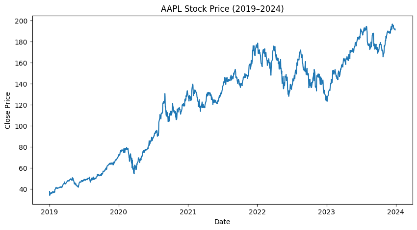

# 📈 Stock Price Forecasting using ARIMA & LSTM

---

## 🎯 Project Overview
This project explores two complementary approaches to stock price forecasting:
- **ARIMA (AutoRegressive Integrated Moving Average)** – a classical statistical model capturing linear temporal dependencies.
- **LSTM (Long Short-Term Memory)** – a deep learning model capable of learning nonlinear and long-range patterns in stock prices.

The project uses Apple Inc. (**AAPL**) daily price data from **2019–2024**, collected via `yfinance`.

---

## 🧩 Data Source
Data was obtained from [Yahoo Finance](https://finance.yahoo.com/) using the `yfinance` Python package.

| Symbol | Company | Period |
|--------|----------|--------|
| AAPL | Apple Inc. | 2019-01-01 → 2024-01-01 |

---

## ⚙️ Models Used

### 1️⃣ ARIMA Model
- Performed Augmented Dickey-Fuller (ADF) Test → Non-stationary series.
- Applied first differencing to achieve stationarity.
- Optimal parameters selected as **ARIMA(5,1,0)**.
- Forecasted 30 days ahead based on training data.

### 2️⃣ LSTM Model
- Scaled data between [0,1] using MinMaxScaler.
- Used the last **60 days** to predict the next closing price.
- Model structure:
- Trained for 30 epochs with batch size 32 using `Adam` optimizer.

---

## 📊 Model Evaluation

| Model | RMSE | Observation |
|--------|-------|-------------|
| **ARIMA(5,1,0)** | ≈ 5.51 | Performs well for general trend, but slightly lagging in volatile periods. |
| **LSTM** | **≈ 4.40** | Outperforms ARIMA; captures short-term fluctuations and nonlinear dynamics. |

**Visual Forecast Comparison:**

---

## 💡 Key Insights & Conclusions

1. **Stationarity matters:**  
 The raw Apple stock price series was non-stationary, but became stationary after first differencing, validating the ARIMA assumption.

2. **ARIMA performance:**  
 The ARIMA(5,1,0) model successfully captured the medium-term trend but struggled with sharp short-term movements, showing slightly delayed responses.

3. **LSTM advantage:**  
 The LSTM network achieved a much lower RMSE (~4.4), learning both trend and seasonality without manual feature engineering.  
 It handled nonlinearity and sudden changes in momentum far better than ARIMA.

4. **Interpretation:**  
 Deep learning approaches like LSTM are better suited for high-frequency or volatile stock data, while ARIMA remains useful for explainable, stable forecasting.

5. **Future Work:**  
 - Extend to multi-feature inputs (volume, sentiment, technical indicators).  
 - Combine ARIMA residuals with LSTM (hybrid ARIMA-LSTM model).  
 - Evaluate performance on other tickers (MSFT, TSLA, BTC-USD).

---

## 🧰 Tech Stack
- **Python**: 3.10  
- **Libraries**: `pandas`, `numpy`, `matplotlib`, `seaborn`, `scikit-learn`, `tensorflow`, `keras`, `statsmodels`, `yfinance`

---

